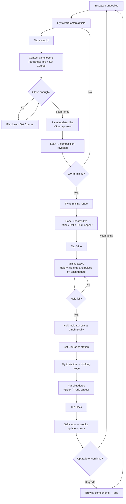
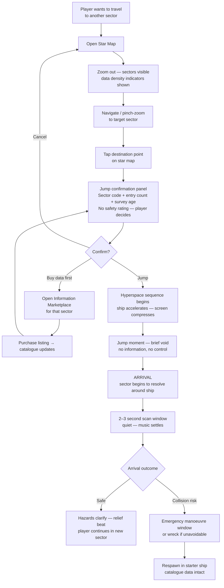
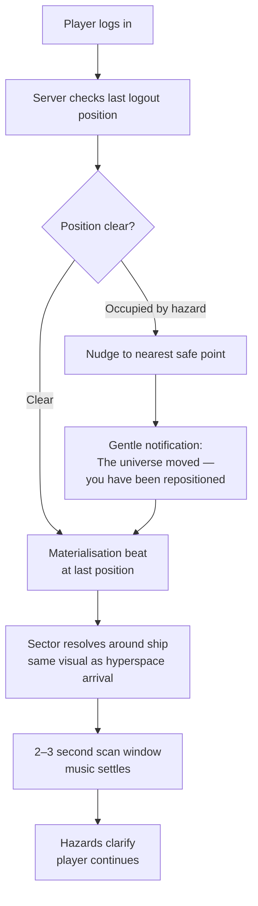
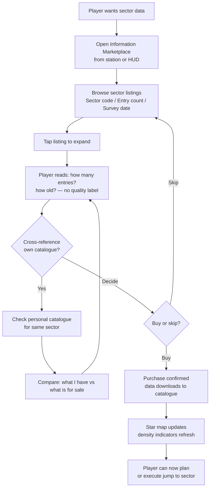
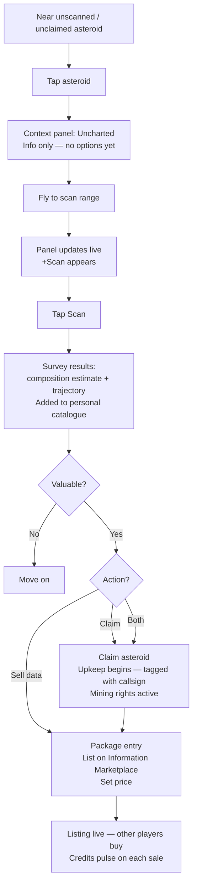
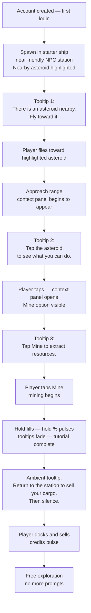

# UX Design Specification — Belter Life

**Author:** Richard
**Date:** 2026-02-20

---

<!-- UX design content will be appended sequentially through collaborative workflow steps -->

## Executive Summary

### Project Vision

Belter Life is a browser-based 2D massively multiplayer asteroid mining, trading, and exploration game. The central UX philosophy is **accessible depth** — a contextual interaction model (simple in open space, progressively richer near interactive objects) that enables touch-first tablet play without sacrificing PC depth. Solo play is a fully valid, structurally protected experience.

### Target Users

| User | Type | Primary Device | Session Pattern | UX Priority |
|---|---|---|---|---|
| Priya | Casual miner | iPad | ~45 min, frequent gaps | Zero-friction re-entry; minimal cognitive load in flight |
| Tariq | Explorer/surveyor | PC + tablet | Longer sessions, deep mechanics | Rich spatial info displays; navigation catalogue tools |
| Sam | New player | Either | Early sessions, discovering | Contextual discovery; no tutorial walls |
| Richard | Administrator | PC | Ops/monitoring | Functional admin panel |

### Key Design Challenges

1. **Contextual UI model** — Designing the "near-object richness" transition to feel intuitive on both touch and pointer input without two separate UI paths
2. **Dual input modality** — Every interaction must work cleanly on touchscreen (tap, swipe, pinch) and PC (mouse, keyboard shortcuts)
3. **Navigation catalogue UI** — Communicating sector coverage, trajectory risk, and data gaps as a spatial star chart before hyperspace jumps
4. **Layered complexity discovery** — Deep systems (info economy, claiming, contracts) must be discoverable through contextual prompts, not mandatory tutorials
5. **Intangible goods marketplace** — Trajectory and composition data must feel spatially meaningful and valuable, not like file downloads

### Design Opportunities

1. **The contextual UI reveal** — The UI blooming from minimal to rich as a player approaches an asteroid is a product-defining interaction moment
2. **Star chart / sector coverage visualization** — A sector map showing known vs. unknown/stale trajectory data could be the game's most visually distinctive element
3. **Session re-entry experience** — Getting the returning-player moment right (ship where you left it, relevant notifications surfaced) builds the habit loop
4. **The hyperspace jump as emotional moment** — A clean jump (full coverage) should feel different from a risky jump (gaps in catalogue)

## Core User Experience

### Defining Experience

The signature interaction of Belter Life is **approach → contextual reveal → act**: a player flies toward an asteroid, the UI transitions from minimal to rich, and they scan, mine, or assess composition before moving on. This cycle — repeated every few minutes — is the heartbeat of the product and must feel completely effortless.

The secondary critical interaction is the **hyperspace jump**: infrequent but high-stakes, deliberate rather than habitual. Both loops must be effortless in different registers — mining is quick and rhythmic; jumping is considered and consequential.

### Platform Strategy

| Dimension | Decision |
|---|---|
| Delivery | Browser-only — web URL is the product, no installation |
| Design lead device | iPad (tablet, touch-first) |
| Full-parity device | PC (mouse + keyboard — enhancement, not separate experience) |
| Screen size floor | ~768px wide (iPad portrait minimum) |
| Offline | Not required — real-time MMO |
| Input principle | All interactions completable by touch alone; keyboard shortcuts are enhancements |

### Effortless Interactions

1. **Session re-entry** — Ship is exactly where it was left; no loading state worth noticing; no catch-up required. Meaningful play within 30 seconds of opening.
2. **Basic flight** — Assisted Newtonian movement via tap-to-head or hold-to-thrust. Feels like pointing, not piloting.
3. **Selling cargo** — Dock → hold summary → sell → credits update. Maximum 3 taps. Never requires a menu tree.
4. **Proximity scanning** — Approaching any asteroid auto-surfaces scan options contextually. No menu to open.
5. **Component comparison** — Card-style visual comparison for ship upgrades, not a stat table.

### Critical Success Moments

| Moment | Significance |
|---|---|
| First completed mining cycle (fly → mine → sell → credits) | The "I get it" moment — must happen within first 5 minutes |
| First hyperspace jump | Establishes world scale; rewards exploration investment |
| Session re-entry after a gap | Builds the habit loop; must feel seamless |
| First navigation catalogue purchase enabling a safe jump | Connects information economy to felt risk reduction |
| Upgrade that visibly improves capability | Makes progression tangible |

### Experience Principles

1. **Space reveals itself** — UI and world complexity emerge contextually as you move; nothing is front-loaded
2. **Every tap counts** — Direct, unambiguous interactions; confirmations only for irreversible actions
3. **Return is a reward** — State preserved exactly; relevant changes surfaced gently; meaningful play within 30 seconds
4. **Risk should be readable at a glance** — Navigation risk communicated visually (colour, density, iconography), not numerically
5. **Progress is always visible** — At least one progress indicator on screen at all times, updating in real time

## Desired Emotional Response

### Primary Emotional Goals

- **Casual players (Priya):** Calm competence — always capable, never overwhelmed, always making perceptible progress
- **Deep players (Tariq):** Capability and investment — depth rewards attention; the universe is genuinely his to engage with
- **Both:** Quiet satisfaction in a living world — the belt moves and breathes; the player's place in it persists and grows

### Emotional Journey Mapping

| Stage | Target Emotion |
|---|---|
| First discovery | Curiosity + "I can do this" |
| Core mining loop | Calm focus + rhythmic satisfaction |
| Contextual UI reveal | Delight + competence |
| Pre-jump preparation | Deliberate assessment — buying data, reading coverage, accepting uncertainty |
| Hyperspace jump (any) | **Tension — always present; data reduces degree, never eliminates it** |
| Post-jump arrival | **Relief + accomplishment** — you made it; but stay alert |
| Post-jump scan moment | Brief vigilance — sector resolving, checking for immediate hazards |
| Selling cargo | Satisfaction + tangible progress |
| Session re-entry after a gap | Familiarity + belonging |
| Death / ship loss | Recoverable setback — not rage, not catastrophe |
| Discovering valuable composition data | Curiosity + strategic excitement |

### The Hyperspace Emotional Contract

The game never tells the player a jump is safe. The navigation catalogue shows what was known at the time of the last survey — not the current state of a sector. Asteroid collisions change trajectories continuously. Even complete coverage cannot account for what happened after the data was collected.

**Buying data reduces tension, it does not resolve it.**

This means:
- Every jump carries genuine risk, regardless of preparation
- Arriving safely is always a relief, not an expectation
- The post-jump scan moment — sector resolving, hazards unresolved — is a designed emotional beat: heart in mouth, then exhale
- Players who invest in data *feel* the difference (less tension) without the game ever promising safety

### Micro-Emotions

| Desired | Avoided |
|---|---|
| Vigilant assessment before jumping | False confidence from data |
| Tension during every jump | Boredom from "safe" jumps |
| Relief on clean arrival | Entitlement to safe outcomes |
| Accomplishment after surviving a close call | Rage at invisible/unfair hazards |
| Ownership of claimed space | Isolation as a solo player |
| Wonder at the belt's scale | Overwhelm from UI clutter |

### Design Implications

- **Tension is permanent → no safety indicators** — the coverage map shows intelligence (what you know, how recent), never a safe/unsafe verdict
- **Relief is designed → post-jump beat** — arrival sequence gives the player a moment of scanning before the music settles; this is intentional pacing
- **Competence → contextual UI** — the right actions surface automatically; the player is never left in a vacuum
- **Calm engagement → ambient HUD** — no urgent alerts for non-urgent events; UI whispers, never shouts
- **Ownership → persistent spatial markers** — claimed asteroids, personal catalogue, wreck log accumulate the player's history
- **Wonder → living world signals** — distant collisions, drifting asteroids, expanding frontier make the world feel alive
- **Recovery → death design** — starter ship floor ensures death is a setback, never a catastrophe

### Emotional Design Principles

1. **The world responds to presence** — proximity triggers contextual richness; the UI is a conversation, not a dashboard
2. **Uncertainty is the product** — hyperspace is never safe, only more or less prepared; the tension is the experience, not a bug
3. **Solo play is whole** — unaligned players feel capable and complete, never structurally disadvantaged
4. **Failure is survivable** — every loss has a recovery path; frustration has nowhere to escalate to rage
5. **The game remembers you** — your history (catalogue, claims, credits, fleet) is always present; the world knows you were here

## UX Pattern Analysis & Inspiration

### Inspiring Products Analysis

**Minecraft** — Proximity-triggered interaction model; world communicates affordances directly; depth is discovered not front-loaded.

**Stardew Valley** — Gold standard for accessible depth; every session is self-contained and satisfying; never punishes logging off.

**No Man's Sky** — Hyperspace jump as designed emotional beat (before/during/after); living world signals; cautionary for cluttered HUD and scan-chore loops.

**EVE Online** — Cautionary reference: tutorial hell, org dependency, spreadsheet economics, nested menus, and loss without a floor are all to be avoided.

**Google Maps / SkySafari** — Spatial coverage display; uncertainty shown through colour/density not hidden; information layers are opt-in; map is primary interface.

**Alto's Odyssey / Monument Valley** — Touch-first premium feel; generous targets; minimal chrome; the world is the UI.

### Transferable UX Patterns

**Adopt:**
- Proximity-triggered contextual panels (Minecraft) → asteroid/station/beacon interactions
- Spatial map as primary navigation catalogue interface (Maps/SkySafari)
- Coverage visualised as density/colour — known=bright, unknown=faded, stale=amber
- Card-style component comparison (Stardew) — not stat tables
- Jump sequence as paced emotional beat with before/during/after (No Man's Sky)
- Minimal open-space HUD — credits, heading, cargo fill only (Alto's)
- Ambient world signals — distant collisions, drifting asteroids, frontier expansion

**Adapt:**
- No Man's Sky arrival moment → extend with post-jump scan beat (sector resolves, hazards unresolved, brief vigilance before music settles)
- Stardew session exit → log out anywhere, any time; no mission traps; no required pre-logout actions

### Anti-Patterns to Avoid

| Anti-pattern | Why |
|---|---|
| Front-loaded tutorial | Kills new players before first success moment |
| Mandatory org participation | Contradicts solo-play-is-whole principle |
| Nested menu trees | Fatal on touch; contradicts "every tap counts" |
| Cluttered multi-priority HUD | Contradicts "space reveals itself" |
| Safety indicators on jumps | Destroys "uncertainty is the product" |
| Loss without a floor | Turns death from setback to catastrophe |
| Scan-everything chore loops | Makes exploration feel like work |
| Trapping the player before logout | Contradicts session freedom; creates anxiety |

### The Unified Materialisation Pattern

A key design insight: **logging back in and arriving via hyperspace are the same experience** — both are "appearing in space from nothing." Both share the same emotional beat and should share the same visual language:

> Sector resolves → brief scan moment → hazards clarify → music settles → you fly

**Session re-entry behaviour:**
1. Server checks last logged-out position
2. If clear → materialise there
3. If occupied (asteroid drifted through) → nudge to nearest safe point in sector, then materialise
4. Gentle notification if nudged: *"Your ship was repositioned — the belt moved while you were away"*
5. Never destroyed for offline hazards — the universe moved; the game adapted

This means the re-entry experience carries the same "arrival dignity" as a hyperspace jump. Logging back in doesn't feel like a loading screen — it feels like a gentle jump into familiar space.

*Note for architecture: safe-spawn position check on re-entry uses the same spatial awareness system as hyperspace collision detection — design as one coherent system.*

### Design Inspiration Strategy

**Minecraft** for the interaction model.
**Stardew Valley** for session design, progression satisfaction, and logout freedom.
**No Man's Sky** for the jump sequence and living world (not its HUD).
**Google Maps / SkySafari** for the navigation catalogue spatial display.
**Alto's Odyssey** for touch-first minimal chrome aesthetic.
**EVE Online** as the explicit anti-reference — every major design decision should be checked against "does this avoid EVE's traps?"

## Defining Interaction Experience

### The Defining Experience

"Tap anything — the world shows you what you can do with it from here. Get closer to unlock more."

Every loop in Belter Life — mining, scanning, docking, trading — is a variation of this tap-to-select, distance-gated interaction pattern. The player always acts with intent (they tapped *that* object); distance then determines what's currently possible. The hyperspace jump is the high-stakes exception: the world cannot tell you whether you'll survive arrival, so you must decide for yourself.

### User Mental Model

Players arrive expecting: tap something to interact with it; closer = more options. This is a well-established mobile and game pattern (tap a building in a strategy game; click a unit in an RTS). Belter Life honours this directly.

**What's novel:** The context panel updates *live* as the player approaches a tapped object — new options appear as range thresholds are crossed, without requiring a re-tap. The object stays selected; the world adds to what it's offering.

**Proximity light-touch signal:** A subtle pulse or glow on stations and objects when the player drifts into interaction range — not a forced panel, just an invitation to tap. The tap remains the required intent signal.

**Potential confusion point:** Players new to range-gated interactions may not understand why [Mine] isn't available yet. Distance indicator on the panel (e.g. "approach to mine") resolves this without tutorial text.

### Success Criteria

- New player discovers mining without a tutorial — tap an asteroid, see [Scan] appear, fly closer, see [Mine] appear
- Experienced player never thinks about the UI — it disappears into intent
- Touch and pointer feel equally natural — tap and click are the same gesture
- Selected object stays selected and panel updates live as player closes distance
- Back in meaningful action within 30 seconds of re-entry
- Belt feels alive without player engagement — asteroids drift, impacts flash

### Distance-Gated Interaction Model

| Distance | Available actions |
|---|---|
| Any visible range | Object info, prior scan data (if catalogued), [Set Course] |
| Scan range | + [Scan] |
| Mining / interaction range | + [Mine] [Drill] [Claim] (context-dependent) |
| Docking range | + [Dock] [Land] [Trade] |

Panel updates in real time as the player moves — no re-tap required. Options appear as thresholds are crossed; options grey out (not disappear) if player moves out of range mid-interaction.

### Novel UX Patterns

| Pattern | Approach |
|---|---|
| Tap-to-select with live range updates | Familiar tap model + novel live panel updates as player approaches |
| Navigation catalogue map | Teach through first jump: contextual prompt on first sector selection |
| Materialisation beat | Shared animation for hyperspace arrivals and session re-entry |
| Data density visualisation | No safety verdict; void is self-explaining on first encounter |
| Information marketplace | Familiar shop chrome; "product" is a sector data packet |

### Experience Mechanics

#### Flow 1 — Tap → Select → Approach → Act

1. **Initiation:** Player taps/clicks any object in the canvas
2. **Selection:** Context panel opens immediately with distance-appropriate options; object highlighted
3. **Approach (optional):** Player flies toward object; panel gains options as range thresholds crossed; no re-tap needed
4. **Interaction:** Player taps chosen action — single gesture, no sub-menus
5. **Feedback:** Action begins immediately; panel shows active state; canvas responds (particles, progress ring, result)
6. **Completion:** Result shown inline in panel (e.g. "+340 iron ore"); panel offers next logical action or dismisses when player moves away

#### Flow 2 — Hyperspace Jump

1. **Initiation:** Navigation catalogue opens (persistent HUD icon → tap/click); sector map shows data density
2. **Preparation:** Inspect target sector; see data density visualisation (bright = known, dark = unknown/absent); optionally visit marketplace to buy sector data; map updates in real time as data purchased
3. **Confirmation:** Select target sector; no safety verdict shown — only "N entries in catalogue for this sector"; player accepts the uncertainty and confirms
4. **Transition:** Jump animation — a felt experience, not a loading screen (~1–2 seconds)
5. **Materialisation beat:** Sector resolves progressively around ship; 2–3 second quiet window; player scans for immediate hazards; music settles
6. **Outcome:** Clean arrival → relief, orient, fly. Near-miss → immediate evasion required. Collision → ship destroyed, respawn flow, setback not catastrophe

## Design System Foundation

### Design System Choice

**Custom game UI** — Tailwind CSS utility foundation + Radix UI headless primitives for accessible overlays.

Belter Life has two UI layers requiring different approaches:
- **Game canvas** (PixiJS/WebGL): fully custom-rendered; no component library
- **Overlay UI** (contextual panels, marketplace, loadout, catalogue): HTML/CSS over canvas using Tailwind + Radix

Standard design systems (Material Design, MUI, Ant) impose web-app visual language incompatible with a game aesthetic and are not used.

### Rationale

- Tailwind provides rapid iteration with full visual control and no imposed aesthetic
- Radix UI headless primitives handle accessibility (keyboard nav, focus trapping, ARIA) for overlays without visual opinion
- Solo developer benefits from Tailwind's utility-first composition model
- Safari compatibility is well-supported by both

### Design Tokens

A minimal shared token set spans both canvas and overlay layers:

| Token | Direction | Usage |
|---|---|---|
| `--bg-deep` | Near-black | Space background, deep panel backgrounds |
| `--bg-surface` | Dark grey | Panel chrome, card surfaces |
| `--accent-gold` | Amber/gold | Credits, valuables, positive states |
| `--text-primary` | Off-white | Primary labels |
| `--text-muted` | Dim grey | Secondary information |
| `--interactive` | Accent highlight | Hover and tap states |

**Navigation catalogue data visualisation tokens:**

| Token | Meaning | Visual direction |
|---|---|---|
| `--data-dense` | Many recent entries in this area | Bright, saturated marks |
| `--data-sparse` | Few or older entries | Faded, desaturated |
| `--data-changed` | Specific entry flagged as superseded by newer data | Amber mark on that entry |
| `--data-absent` | No entries — pure unknown | Empty dark space (no colour) |

The catalogue map never asserts "safe" or "dangerous." It shows only what the player knows and when they knew it. Empty space is unknown — the void speaks for itself. The only explicit warning state (`--data-changed`) applies to specific entries where newer data has contradicted a previous catalogue entry.

### Customisation Strategy

All overlay components are built from Tailwind utility classes styled to the token set above. Radix primitives are used for any interaction requiring accessibility guarantees (modals, dropdowns, tooltips, focus traps). No external component library visual defaults are used or imported.

## Visual Design Foundation

### Colour System

Deep space palette — near-black void with precise, purposeful colour for information and state. UI lives over the world without obscuring it.

| Token | Value direction | Usage |
|---|---|---|
| `--bg-deep` | Deep blue-black | Canvas background |
| `--bg-panel` | Dark (~#12141e) | Panel backgrounds |
| `--bg-surface` | Slightly lighter | Panel chrome, separators |
| `--bg-raised` | (~#222640) | Elevated elements, hover |
| `--text-primary` | Off-white | Primary readable text |
| `--text-muted` | Dim grey | Secondary labels, metadata |
| `--accent-gold` | Mellow amber-gold | Credits, value, positive states |
| `--interactive` | Soft blue-white | Selected objects, tap/hover states |
| `--data-dense` | Bright teal-white | Strong recent catalogue entries |
| `--data-sparse` | Faded cool grey | Old or sparse catalogue entries |
| `--data-changed` | Warm amber | Superseded trajectory entry |
| `--data-absent` | (no colour — canvas dark) | Unknown — void speaks for itself |
| `--positive` | Muted green | Confirmed actions, successful trades |
| `--destructive` | Deep muted red | Ship loss, failed actions |

Catalogue visualisation uses density and shape alongside colour — never colour-only encoding.

### Typography

**Primary UI font:** Inter — exceptional legibility, excellent Safari rendering, free. All panels, labels, body text.

**Flavour font:** DM Mono (monospaced) — used sparingly for data-feeling elements: station names, sector IDs, catalogue timestamps. Suggests navigation charts and ship logs.

| Level | Size | Weight | Usage |
|---|---|---|---|
| Screen title | 20px | 600 | Overlay/screen headers |
| Panel header | 16px | 600 | Context panel titles |
| Body | 14px | 400 | Panel content, listings |
| Label | 12px | 500 | HUD indicators, compact labels |
| Micro | 11px | 400 | Timestamps, coordinates, metadata |

Minimum touch-safe body text: 14px.

### Spacing & Layout Foundation

**Base unit:** 8px. All spacing in multiples of 8.
**Touch targets:** 44×44px minimum; 48×48px preferred for primary actions.

**Layout principles:**
1. **Canvas-first** — game world always visible; panels overlay, never replace
2. **Edge-anchored panels** — slide in from nearest screen edge; canvas remains
3. **HUD at periphery** — ambient indicators at screen edges, never centre
4. **Bottom-biased actions** — primary buttons in thumb-reach zone on tablet
5. **Compact but tap-safe** — 16px internal panel padding minimum

**Canvas-to-panel split:**
- No selection: 100% canvas
- Far range selection: ~75% canvas / ~25% narrow info panel
- Interaction range: ~60% canvas / ~40% action panel
- Full overlay (marketplace, catalogue): canvas dimmed behind, never hidden

### Accessibility

- WCAG AA contrast (4.5:1 body, 3:1 large text) across all text tokens
- Touch targets ≥44×44px throughout
- No colour-only information encoding
- Keyboard navigation via Radix UI focus management

---

## Design Direction Decision

### Design Directions Explored

Three directions were explored across an interactive HTML showcase:

- **A — Ghost Ship**: Ultra-minimal, near-invisible HUD; ghost panel fades from right edge; canvas breathes fully
- **B — Navigator**: Persistent bottom stats bar (credits/hold/speed); structured framed context panel with header, body, and action tiers
- **C — Prospector**: Left sidebar for persistent nav actions; context as a bottom sheet; pip-indicator hold display

Additionally, two **Shared Screens** (Navigation Catalogue Map and Information Marketplace) were confirmed as direction-independent — their design language holds regardless of HUD choice.

### Chosen Direction

**Direction B — Navigator**, with the Shared Screens design confirmed as canonical.

The Ghost Ship and Navigator directions were noted as visually similar in practice; the Navigator's persistent bottom bar provides just enough structural grounding without imposing heavy chrome. The Prospector's bottom sheet was noted as the most touch-native pattern but not selected.

### Design Rationale

- The persistent bottom bar gives the player constant situational awareness (credits, hold capacity, speed) without demanding interaction — it answers the "how am I doing?" question passively
- The framed context panel with clear header/body/actions tiers makes the distance-gated interaction model (tap anything → see what you can do → get closer to unlock more) legible and trustworthy
- The Navigator direction sits between Ghost Ship's minimalism and Prospector's structure, matching a player who is equally comfortable on iPad and PC

### Implementation Approach

- Bottom stats bar: persistent, edge-anchored, translucent overlay on game canvas
- Context panel: slides in from right on tap/click, updates live as player moves
- Actions rendered in tiers within panel: always-available → range-gated (greyed until in range)
- Shared Screens (catalogue map, marketplace) use the data density token system (`--data-dense`, `--data-sparse`, `--data-changed`, `--data-absent`) established in the Design System Foundation
- Navigation Catalogue Map and Information Marketplace remain direction-independent and can be accessed from any HUD state

---

## User Journey Flows

### Journey 1: Core Mining Loop — Priya

The primary game loop. Designed around a casual session with minimal friction.

### Journey 2: Hyperspace Jump — All Players

The game's highest emotional-stakes interaction. Data quality surfaces at the decision point — never as a warning gate.

**Design note:** The jump confirmation panel never says "safe" or "unsafe". It shows the data the player has. The void is the signal.

### Journey 3: Session Re-Entry — Priya

Designed around the Unified Materialisation Pattern: re-entry and hyperspace arrival share the same visual language.

**Design note:** "Nudge on re-entry" uses the same spatial awareness check as hyperspace arrival. One coherent system.

### Journey 4: Navigation Catalogue Purchase — Tariq

The information economy flow. No quality score is shown — entry count and survey age are the only signals.

### Journey 5: Asteroid Survey & Claim — Tariq

The data creation loop. Tariq's surveys are the supply side of the information economy.

### Journey 6: New Player First Encounter — Sam

Three contextual tooltips. No tutorial screen. The world teaches by doing.

**Design note:** After the ambient "sell your cargo" prompt, the game goes quiet. The contextual UI model takes over — the world teaches by proximity, not by instruction.

### Journey Patterns

Three patterns repeat across all 6 flows:

**1. Live Panel Updates**
Context panel never requires a re-tap as the player approaches. Options appear and grey-out dynamically. The player's movement *is* the navigation.

**2. The Pulse**
Every moment of meaningful change (hold filling, credits updating, catalogue refreshing) pulses visually. The HUD is ambient but alive — never silent, never shouting.

**3. The Materialisation Beat**
Appears in Flows 2 and 3 identically: sector resolves → quiet scan window → hazards clarify → music settles. One system. Two entry points (jump arrival, session re-entry). The universe reasserting itself.

### Flow Optimisation Principles

1. **Minimum taps to value** — mining starts in 3 taps from open space (tap asteroid → fly → tap mine)
2. **No confirmation walls** — sell, scan, and dock all execute in one tap; only hyperspace requires confirmation (the stakes justify it)
3. **Delight is in the pulse** — the game rewards progress through motion and light, not dialogue
4. **Error recovery preserves catalogue** — wreck and respawn never destroy navigation data; ship is the sacrifice, knowledge is kept
5. **The void is informative** — absent catalogue entries on the star map are meaningful, not blank UI; empty space speaks

---

## Component Strategy

### Design System Components

**Radix UI headless primitives** provide accessible interaction scaffolding. All require custom styling via Tailwind — no default visual opinions imposed.

| Component | Role in Belter Life |
|---|---|
| `Dialog` | Hyperspace confirmation modal; marketplace full-screen overlay |
| `Tooltip` | HUD label overlays; tutorial prompts |
| `Popover` | Anchor point for context panel positioning |
| `Progress` | Hold capacity bar base element |
| `ToggleGroup` | Mining mode selection; ship system toggles |
| `ScrollArea` | Marketplace listings; catalogue entry list |
| `Separator` | Context panel section dividers |

### Custom Components

#### Context Panel

**Purpose:** The primary tap-to-interact surface. Surfaces contextual actions for any tapped object, gated by distance. The defining UI component of Belter Life.

**Usage:** Opens on tap/click of any interactive object. Persists until player taps open space or dismisses.

**Anatomy:**
- Header: object name + type icon + distance indicator
- Body: available actions only (no locked or greyed items)
- Footer: "Get closer for more" proximity invite — visible only when additional range-gated actions exist; disappears when player is fully in range
- Dismiss: tap outside panel or swipe right

**States:**

| State | Description |
|---|---|
| `far` | Header + object info only; footer shows proximity invite |
| `scan-range` | +Scan action appears; footer updates or disappears |
| `mining-range` | +Mine / Drill / Claim appear; footer gone |
| `docking-range` | +Dock / Trade / Talk appear |
| `loading` | Skeleton shimmer while scan results return |
| `transitioning` | New action fades in as player enters range |

**Interaction behaviour:** Panel content updates live as player moves — no re-tap required. New actions fade in. "Get closer for more" footer fades out as the last range gate is cleared.

**Accessibility:** `role="complementary"`, `aria-label="[object name] actions"`, focus trapped when open on keyboard, Escape to dismiss.

---

#### HUD Bottom Bar

**Purpose:** Persistent ambient situational awareness strip. Answers "how am I doing?" without demanding attention.

**Usage:** Always visible during flight. Sits at bottom edge of viewport, translucent overlay on canvas.

**Anatomy:**
- Credits display (left)
- Hold capacity bar + percentage (centre)
- Speed indicator (right)
- Expandable zone: additional stat slots for future use

**States / variants:**

| Element | Behaviour |
|---|---|
| Credits | Pulses (scale + brightness flash) on any change |
| Hold % | Bar fills left-to-right; pulses on each ore deposit; emphatic pulse + colour shift when full |
| Speed | Live numeric; no pulse (continuous change would be noisy) |

**Pulse spec:** 150ms ease-out scale to 1.08 + brightness +20%, return over 300ms. Triggered on value change. Not triggered on page load.

**Accessibility:** `role="status"`, `aria-live="polite"` on credits and hold % for screen reader announcements. Speed excluded from live region (too frequent).

---

#### Star Map

**Purpose:** Sector navigation for hyperspace jump planning. The player's macro spatial view of the universe.

**Usage:** Opened from HUD or via "Plot Course" in context panel. Full-screen overlay on canvas.

**Anatomy:**
- Zoomable sector grid (pinch/scroll — Google Maps model)
- Sector tiles coloured by data density token
- Selected sector: tap to open jump confirmation panel
- Own position indicator: persistent marker
- Beacon/bookmark markers: future phase

**Sector tile states:**

| Token | Visual | Meaning |
|---|---|---|
| `--data-dense` | Bright teal fill | Many recent entries |
| `--data-sparse` | Faded grey fill | Few or old entries |
| `--data-changed` | Amber border pulse | Known entry contradicted by newer data |
| `--data-absent` | Empty — canvas colour only | No entries — the void speaks |

**Interaction:** Pinch/scroll to zoom. Tap sector tile → shows entry count + survey age + Jump button. No typing required; sector codes shown as labels, not primary navigation.

**Accessibility:** Keyboard arrow key navigation between sectors; Enter to select; screen reader announces sector code + data status on focus.

---

#### Materialisation Screen

**Purpose:** The shared visual beat for hyperspace arrival and session re-entry. The universe reasserting itself.

**Usage:** Triggered automatically on jump arrival and login. Not dismissable — plays to completion (2–3 seconds).

**Sequence:**
1. Black void (jump transit / login loading)
2. Sector begins to resolve — objects fade in from centre outward
3. Quiet scan window — 2–3s, minimal UI, ambient audio only
4. Hazards clarify fully — particle density settles
5. Bottom bar fades in — player control restored
6. If nudged on re-entry: gentle notification slides in after step 5

**States:** `arriving` | `scanning` | `settled` | `nudged` (re-entry only)

**Accessibility:** `aria-live="assertive"` announces "Arrived in [sector]" or "Returning to [sector]" at step 5. No interaction required during sequence.

---

#### Data Density Indicator

**Purpose:** Compact representation of navigation catalogue coverage for a named sector. Used in Star Map tiles and marketplace listings.

**Usage:** Wherever sector data quality needs communicating without a quality score.

**Anatomy:** Small coloured pip + sector code label + optional age string ("3 days ago")

**Variants:**
- `tile` — Star Map (large, tap target)
- `inline` — marketplace listings (small, display only)
- `badge` — jump confirmation panel (medium, prominent)

**States:** Maps directly to four tokens: `dense` / `sparse` / `changed` / `absent`

---

#### Pulse Indicator

**Purpose:** Wraps any numeric display and applies the standard pulse animation on value change.

**Usage:** Composable wrapper used by HUD Bottom Bar, credit counters, hold %, marketplace sale notifications.

**Behaviour:** Observes value prop. On change: 150ms scale-up + brightness flash → 300ms ease-out return. Configurable intensity: `subtle` (default) | `emphatic` (hold full, large credit change).

**Accessibility:** Visual only — does not affect screen reader output. Value change announced by parent's `aria-live` region.

---

#### Tutorial Tooltip

**Purpose:** The three contextual prompts in Sam's first encounter. Self-advancing, non-blocking, world-anchored.

**Usage:** First session only. Max 4 tooltips (3 action prompts + 1 ambient sell prompt). Never shown again after dismissal.

**Anatomy:**
- Arrow pointing to world-space target (asteroid, panel, button)
- Short prompt text (max 12 words)
- Auto-advances when player completes the prompted action
- Last tooltip (ambient) auto-dismisses after 30s

**States:** `visible` | `completing` (player doing the action — tooltip pulses) | `dismissed`

**Rules:**
- Never blocks the tapped target
- Repositions if viewport edge would clip it
- Respects `prefers-reduced-motion` — no animation, just appear/disappear

---

#### Catalogue Listing Card

**Purpose:** Marketplace entry display. Shows what the player needs to make a purchase decision — nothing more.

**Usage:** Within ScrollArea in the Information Marketplace overlay.

**Anatomy:**
- Sector code (prominent)
- Data Density Indicator badge
- Entry count: "47 entries"
- Survey age: "Last updated 2 days ago"
- Price
- Buy button (single tap, confirmation via system Dialog)

**States:** `available` | `already-owned` (player has newer data) | `purchasing` | `purchased`

**Content rules:** No "quality" label. No star ratings. No percentage coverage. Entry count + age only. Player decides.

---

### Component Implementation Strategy

**Layer 1 — Game Canvas (PixiJS):** No HTML components. Custom WebGL rendering for all in-world objects. Canvas communicates state changes to Layer 2 via event bus.

**Layer 2 — HTML Overlay:** All 8 custom components + Radix primitives. Positioned absolutely over canvas. Tailwind for styling. Design tokens shared via CSS custom properties.

**Token bridge:** Both layers read from the same CSS custom property token set. PixiJS reads token values via `getComputedStyle` at runtime for canvas-drawn UI elements.

### Implementation Roadmap

**Phase 1 — Core flow (must ship for MVP):**
- Context Panel — gates the entire interaction model
- HUD Bottom Bar + Pulse Indicator — ambient feedback
- Materialisation Screen — hyperspace + re-entry beat
- Star Map — hyperspace navigation

**Phase 2 — Economy flows:**
- Data Density Indicator — used in catalogue + marketplace
- Catalogue Listing Card — information marketplace
- Tutorial Tooltip — new player onboarding

**Phase 3 — Polish:**
- Expand Pulse Indicator coverage to all economic events
- Beacon markers on Star Map (future phase)
- Organisation dashboard components (Phase 2 gameplay)
